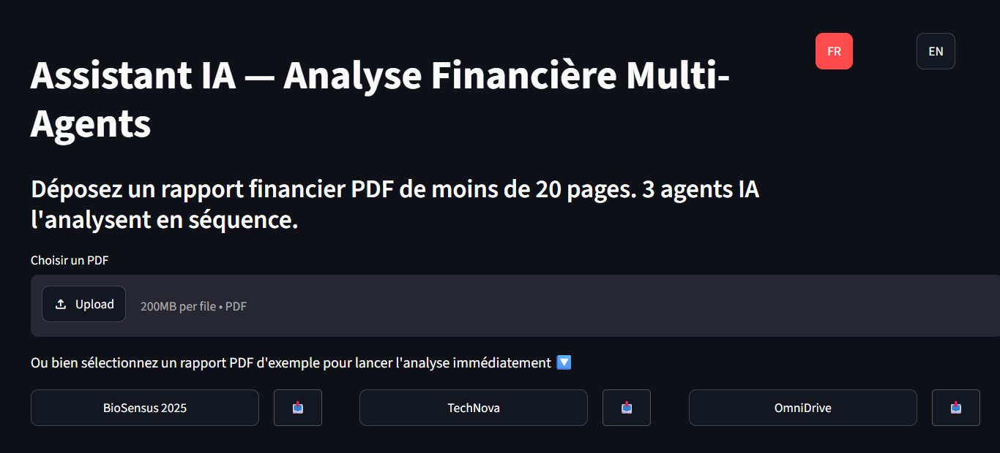

# 📊 Assistant IA Multi-Agents — Analyse Financière


## Description
Application web **conteneurisée avec Docker** qui analyse automatiquement des rapports financiers PDF grâce à une architecture multi-agents (LangGraph + LangChain + RAG + ChromaDB). L'application permet aux utilisateurs de télécharger des PDF ou de sélectionner des exemples prédéfinis pour une analyse immédiate.

## 📸 Aperçu de l'interface


*Légende : Interface utilisateur Streamlit avec sélection de langue et compteur de temps réel.*

## ✨ Fonctionnalités clés

* 🤖 **Architecture Multi-Agents** : Découpage des tâches et de la logique métier entre un agent extracteur (RAG), un analyste de risques et un rédacteur de synthèses via LangGraph.
* 📊 **Rapports pré-chargés** : Intégration de 3 exemples de rapports réels (*BioSensus, TechNova, OmniDrive*) pour tester l'application instantanément sans téléversement obligatoire.
* 🌍 **Interface Multilingue** : Support natif et complet de l'interface en Français et en Anglais commutable en un clic.
* ⏱️ **Compteur de Temps Réel** : Intégration d'un indicateur de temps estimé pendant l'exécution séquentielle des agents pour optimiser l'expérience utilisateur.

---

## 📂 Structure du projet

L'architecture du code est découpée de manière modulaire afin de respecter les bonnes pratiques d'ingénierie logicielle :

```text
├── .vscode/               # Configuration locale de l'éditeur VS Code
├── agents/                # Agents IA spécialisés autonomes
│   ├── __init__.py
│   ├── analyzer.py        # Agent d'analyse des risques (Ollama/Groq)
│   ├── extractor.py       # Agent d'extraction et chunking PDF (ChromaDB)
│   └── writer.py          # Agent de rédaction de la synthèse managériale
├── assets/                # Images et ressources visuelles du projet
│   └── 1dashboard.png     # Capture d'écran de l'interface applicative
├── sample_reports/        # Les 3 rapports PDF financiers d'exemples
│   ├── Rapport_Financier_Avance_OmniDrive.pdf
│   ├── Rapport_Financier_TechNova.pdf
│   └── Rapport_Performance_BioSensus_2025.pdf
├── utils/                 # Fonctions utilitaires partagées
├── venv/                  # Environnement virtuel local Python
├── .env                   # Variables d'environnement privées (Clés API - Masquées)
├── .gitignore             # Fichiers exclus du suivi de version Git
├── app.py                 # Interface utilisateur et frontend Streamlit
├── graph_builder.py       # Coeur du système : Construction et compilation du graphe LangGraph
├── README.md              # Documentation principale du projet
└── requirements.txt       # Liste complète des dépendances Python requises